# Welcome to my REACT PORTFOLIO!

## Description

### This REACT PORTFOLIO was created to share a little bit about myself, some of my latest projects, provide my contact information, a form to contact me, and to provide my resume to employers.

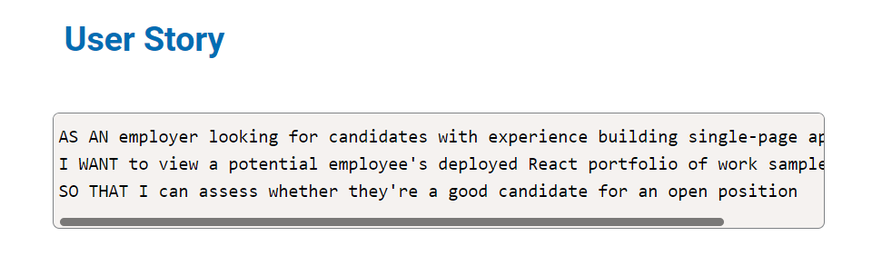

## Table of Contents
* [Installation](#installation)
* [Usage](#usage)
* [Deployment](#deployment)
* [License](#license)
* [Contributor](#contributor)

## Installation
### In order to install this repository, you will need to clone it and run npm init and npm install to install all of the dependencies listed inside the package.json file.

## Usage
### To use this app after cloning and initializing the dependencies, run npm start in the terminal to start it.

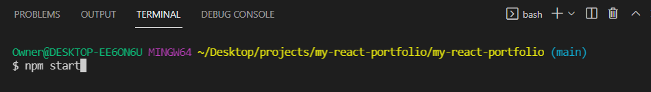

### You will then see the confirmation that the app is running.

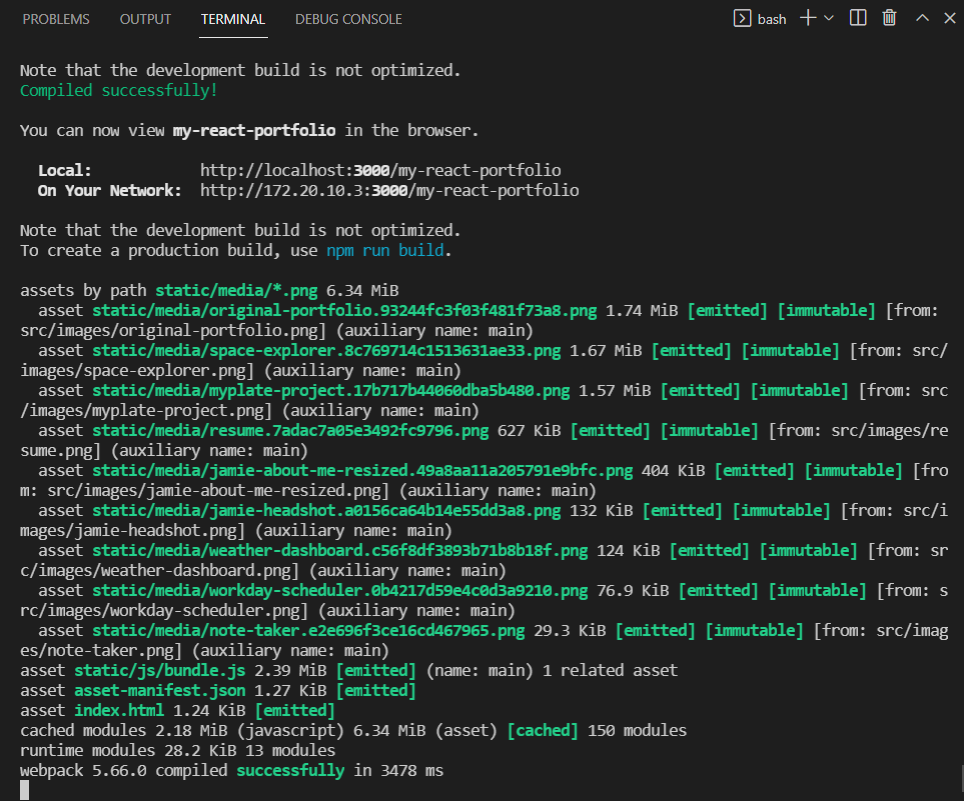

### When the app opens, you will be greeted with my intro and the sticky navigation bar.

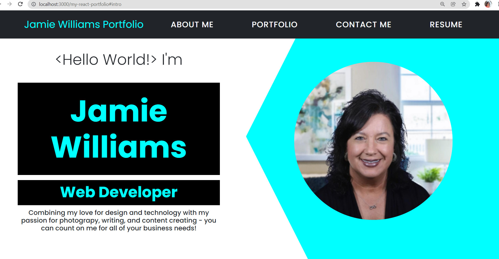

### When you click on the 'About Me' tab of the navigation bar, you will be taken to the 'About Me' section.

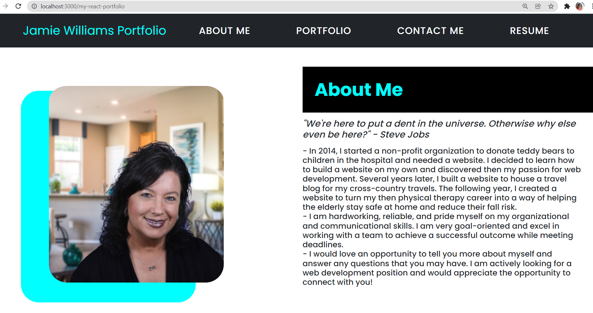

### When you click on the 'Portfolio' tab of the navigation bar, you will be taken to the 'Portfolio' section displaying 6 of my latest projects.

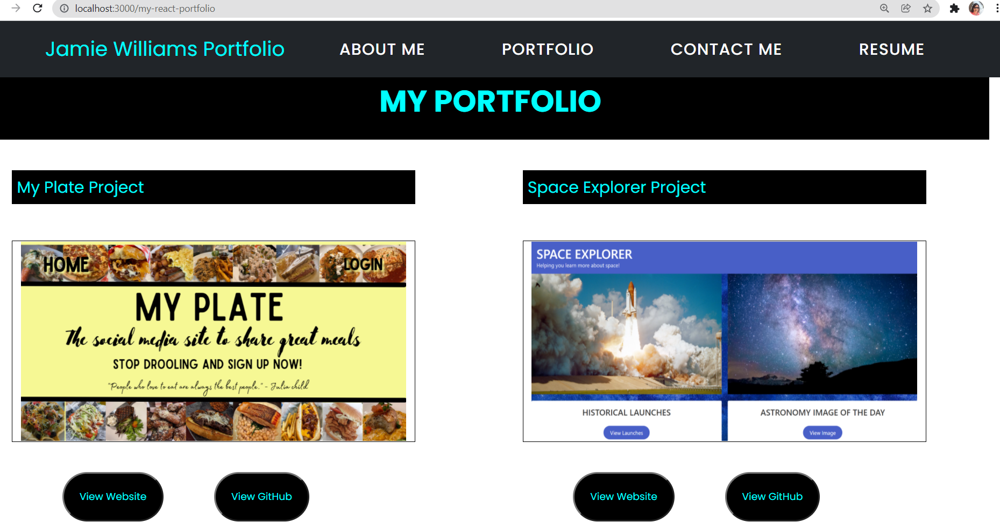

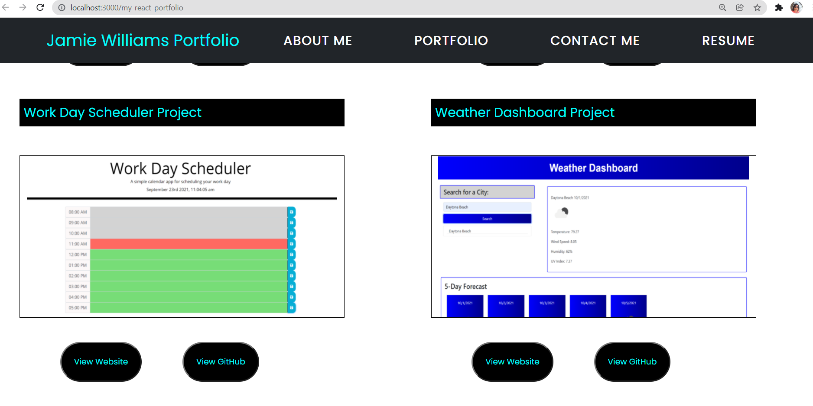

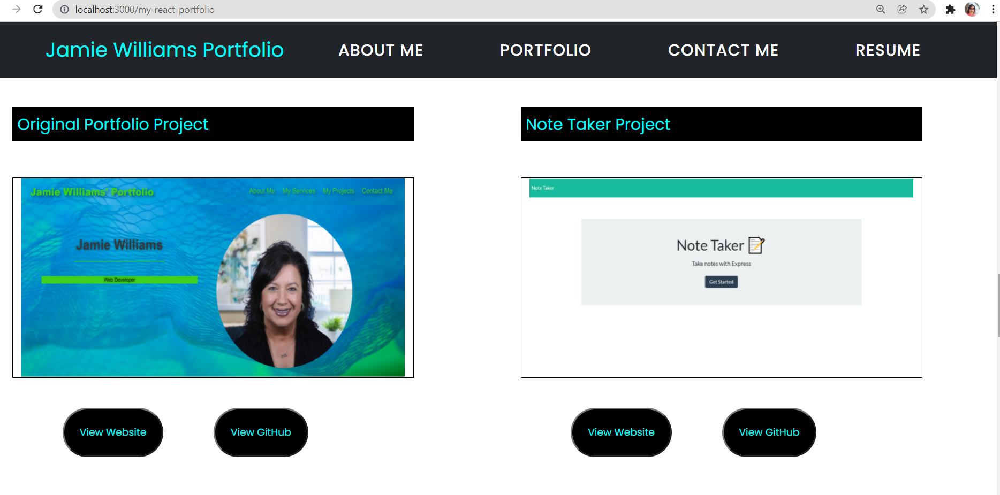

### When you click on the 'View Website' button of any project, you will be directed to the project's deployed website.

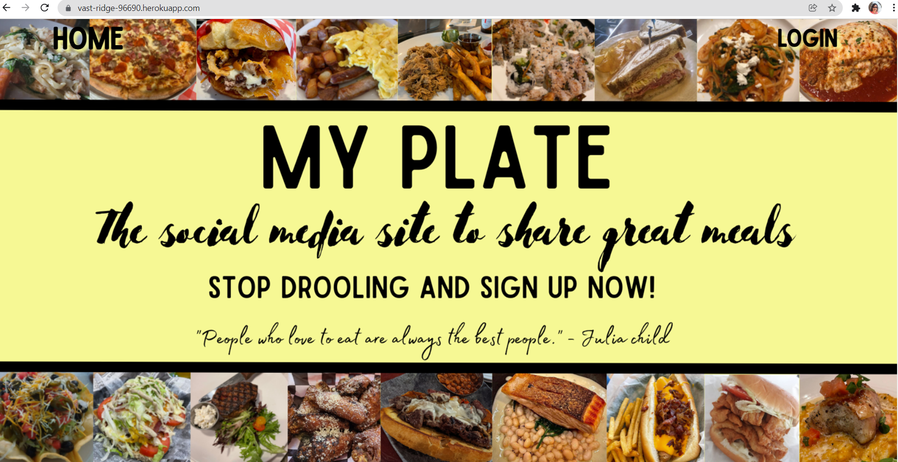

### When you click on the 'View GitHub' button of any project, you will be directed to the project's GitHub page.

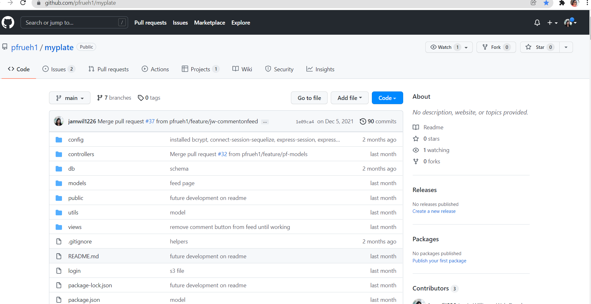

### When you click on the 'Contact Me' tab of the navigation bar, you will be taken to the 'Contact Me' section displaying my phone number and email address along with a contact form.

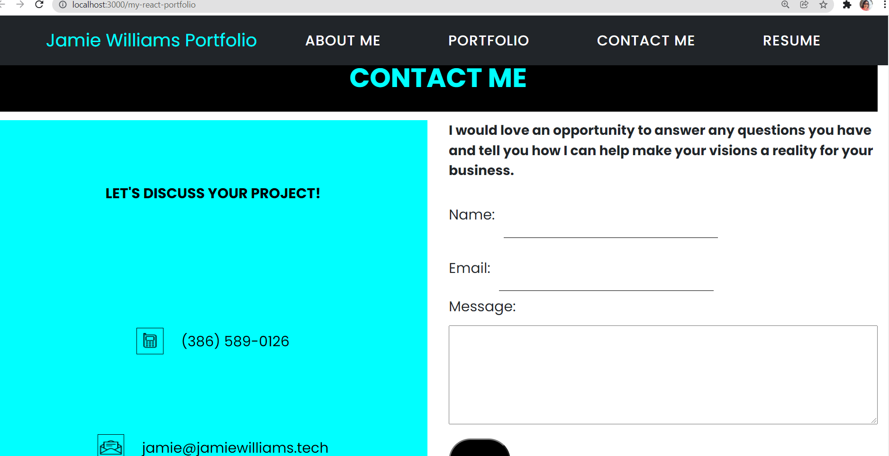

### The contact form has validation for the name, email, and message.

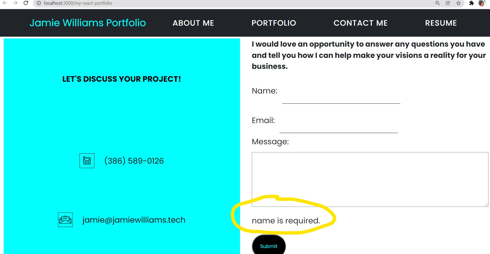

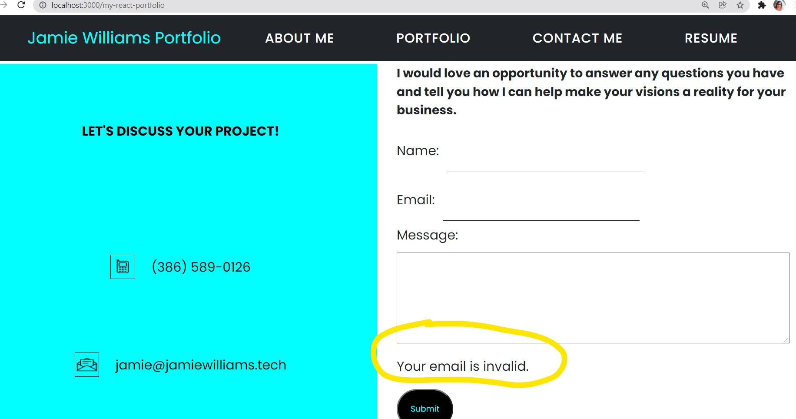

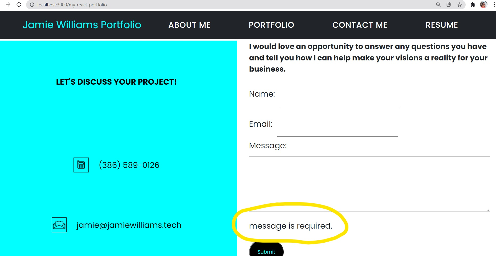

### When you click on the 'Resume' tab of the navigation bar, you will be taken to the 'Resume' section displaying my Resume along with a button to download my Resume as a PDF.

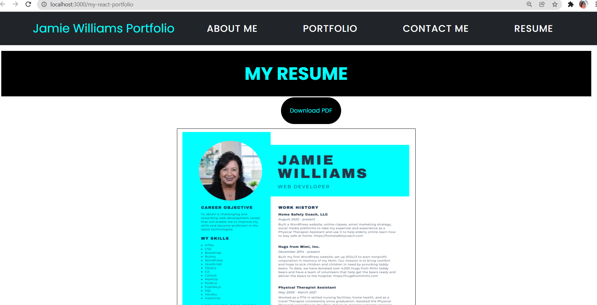

### The footer displays links to my GitHub, LinkedIn, and StackOverflow accounts.

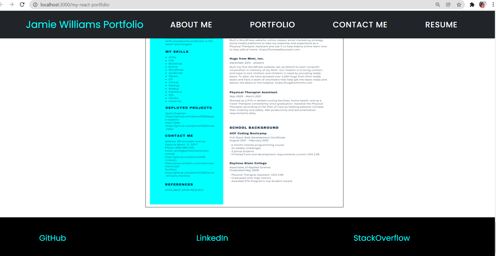

### This site is mobile responsive to all screen sizes.

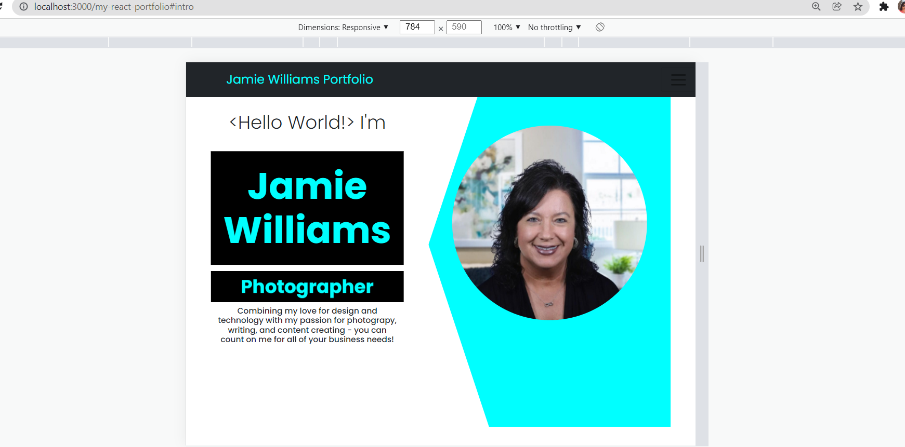

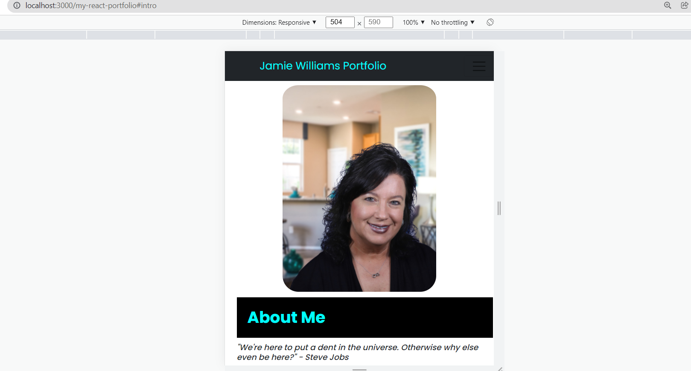

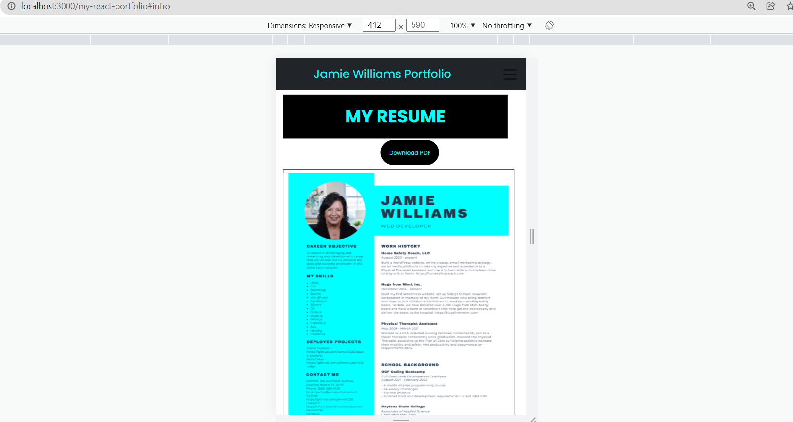

## Deployment
### You can find my REACT PORTFOLIO deployed at https://jamwil1226.github.io/jamie-williams-react-portfolio/

### I hope you enjoy viewing my REACT PORTFOLIO! I welcome all contributions and feedback!

## License
### The license for this project is the MIT.

Copyright © 2021

## Contributor
### *If you have any questions, please reach out to me.*

### _Jamie Williams_ 

### Jamie's GitHub: [@jamwil1226](https://github.com/jamwil1226/)